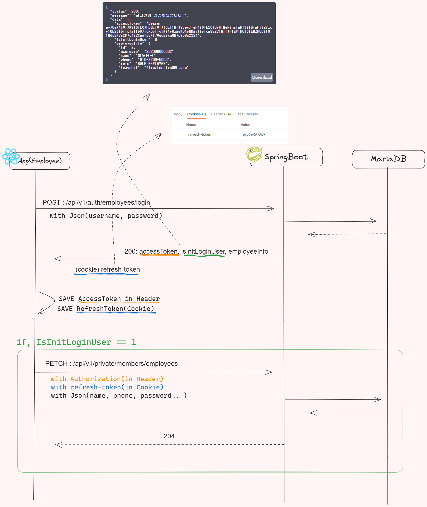
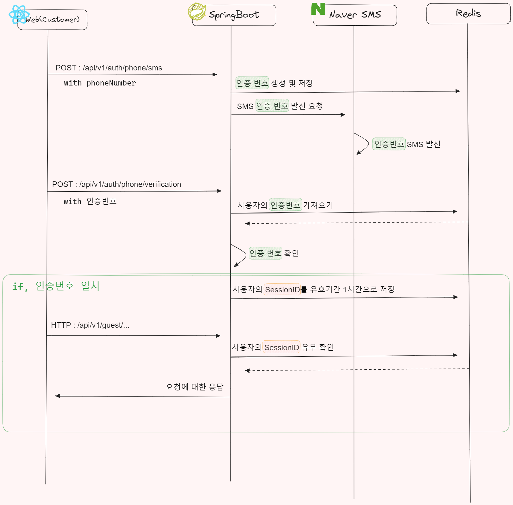
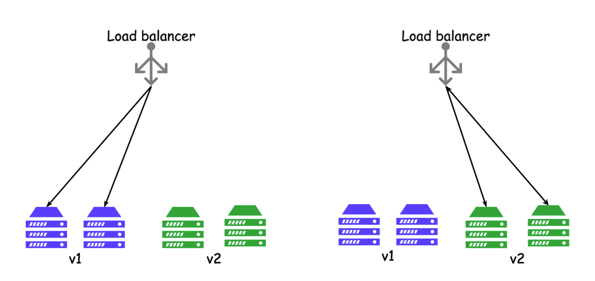
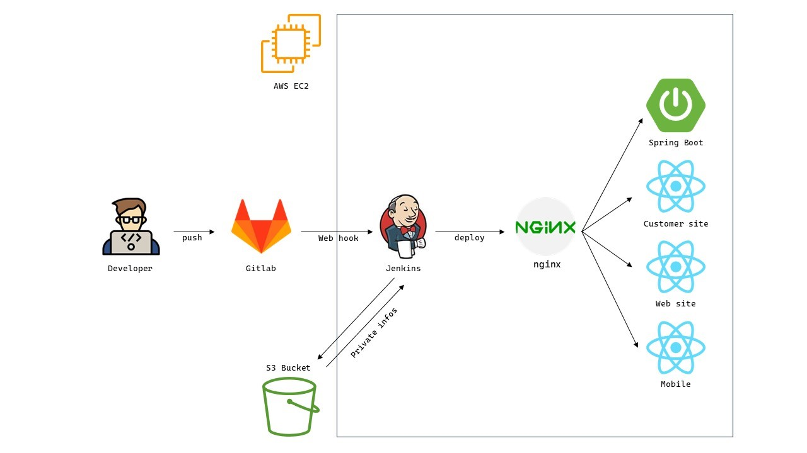
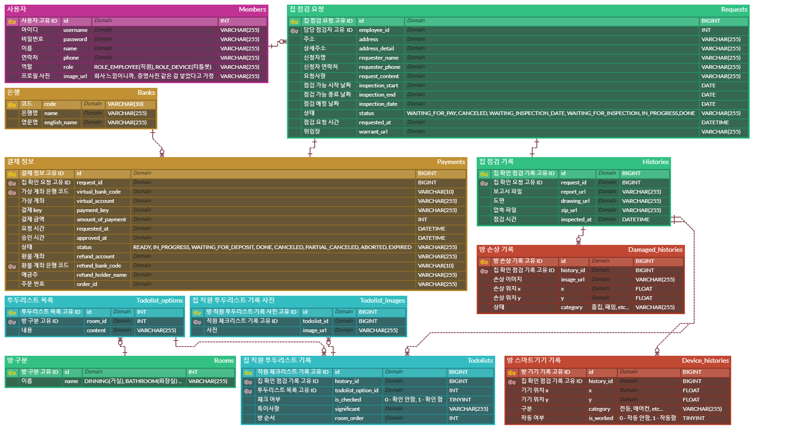

# 이게MO징 - Backend

## 🔎 목차

1. <a href="#functions">🚀 구현 사항</a>
1. <a href="#advantages">🌟 기술 특장점</a>
1. <a href="#pipeline">🎞️ CI/CD 파이프라인 구조도</a>
1. <a href="#skills">🛠️ 기술 스택</a>
1. <a href="#directories">🗂️ 파일 구조</a>
1. <a href="#erd">💾 ERD</a>
1. <a href="#swagger">💾 Swagger API docs</a>
1. <a href="#retrospective">✒ 회고</a>

<br/>

## 🚀 구현 사항

<a name="functions"></a>

- SpringSecurity & JWT기반 회원 보안
- 문자SMS & Redis & Session 기반 비회원 보안
- Gitlab, Jenkins, Nginx, Docker, AWS EC2를 활용한 Spring Boot, React CI/CD 구축
- IoT기기와 App 사이의 Socket통신 구현
- Toss를 통한 가상계좌 이체 서비스 구현
- Naver SMS API를 이용한 휴대폰 인증 구현
- AWS EC2, S3를 활용한 이미지/설정 파일 관리
- Swagger API 문서환경 구축

<div align="right"><a href="#tableContents">목차로 이동</a></div>

<br/>

## 🌟 기술 특장점

<a name="advantages"></a>

### ✔️ Web Socket 메시지 JSON을 통한 유형 분류

이미지 들어갈 곳

-   JSON을 통하여 Spring Boot 서버에서 각 요구사항에 따른 비즈니스 로직이 동작됨
    -   예를 들어, `AUTH` Type의 JSON을 메시지로 받았다면
        ```jsx
        {
            "type" : "AUTH",
            "data" : {
                "accessToken" : "...."
            }
        }
        ```
        위의 메시지에서 accessToken이 유효한지 판단하여, 신뢰된 소켓 통신의 참여자로 별도의 자료구조에 등록함
    -   예를 들어, `DAMAGED` Type의 JSON형식을 메시지로 받았다면
        ```jsx
        {
            "type" : "DAMAGED",
            "data" : {
                "x" : "....",
                "y" : "....",
                "image" : "...."
                "category" : "...."
            }
        }
        ```
        image는 S3서버에 저장되여 imgUrl을 생성하며, 손상 정보에 대한 정보를 DB에 등록시킴
-   타입에 따른 각 비즈니스 로직을 수행함으로써 Employee의 Device의 동작 제어 및 데이터 수신이 가능하게 됨

---

### ✔️ Map 자료구조를 통한 신뢰된 소켓 참여자의 세션관리

1. **Map<Long, Session>** 형태로 사용자(Employee, Device)의 ID와 사용자의 Session을 매핑하여 관리함
2. 위의 자료구조는 AUTH Type의 JSON이 수신되었을 때, Token기반의 인증방식을 통하여 **보안성**을 갖춤
3. Employee와 Device에 대하여, 연결 정보를 Session 저장하여 확인하는 방식을 통해 1:N구조 통신이 가능하도록 함
    1. 즉, 서로가 어떤 소켓 참여자에게 데이터를 보내야하는지를 Session에 저장된 정보로 확인할 수 있음

---

### ✔️ 회원(직원)에 대하여 Jwt(Access/Refresh Token)방식 적용



**JWT(Access/refresthToken)방식 적용 이유**

-   서비스 업체의 직원은 앱과 웹애 대하여 빈번한 로그인 및 앱 접근을 할 것으로 기대
-   기존의 JWT보다 강화된 Access/Refresh 방식을 취하여 AccessToken과 RefreshToken을 이용하여 보안을 갖추면서도 빈번한 로그인 시도를 줄이는 통신보안방법을 채택

**JWT방식 적용을 통한 이점**

-   짧은 유효시간을 가진 AccessToken의 특징을 통해 토큰이 탈취되더라도 악용할 가능성을 줄일 수 있음
-   자동 갱신을 목적으로 한 RefreshToken을 통하여 사용자는 자주 재인증을 하지 않아도 되므로, 사용자 경험이 향상됨

**사진 설명**

-   Employee가 로그인시, SpringBoot서버에 토큰 발급을 요청함
-   발급된 토큰을 React에서 저장함
-   이후, 발급된 토큰정보과 함께 HTTP API에 요청을 보냄
    -   이때, AccessToken이 유효하다면 작업 수행
    -   이때, AccessToken이 유효하지 않다면 401코드를 반환받고 토큰 재발행

---

### ✔️ 비회원(고객)에 대하여 SMS 인증 & Session과 Redis를 통한 보안 적용



**비회원에 대하여 JWT 방식을 취하지 않은 이유**

-   고객은 서비스에 대하여 일회성 사용이 기대되어 TWT 방식보다 로우레벨의 인증방식이 적합할 것으로 판단

**Session과 Redis를 이용한 사용자 보안 향상**

-   고객은 웹페이지 이용시, 신원정보 확인을 위하여 휴대전화 SMS인증을 실시(ft. 네이버 SMS API)
-   휴대전화 SMS인증 이후, 고객의 SessionID는 Redis에 저장되어 1시간의 유효시간이 부여
-   해당 시간 내에서만 사용자의 웹페이지 접근이 가능하기 때문에, 사용자의 보안성이 향상

---

### ✔️CI/CD 구축과 Blue Green 배포 전략

**활용한 도구 및 기술 스택**

-   **Source Code Management**: Gitlab
-   **Integration & Deployment**: Jenkins
-   **Server & Load Balancer**: Nginx
-   **Containerization**: Docker
-   **Cloud Platform**: AWS EC2
-   **Application Framework**: Spring Boot (Backend), React (Frontend)

**서버 구조 및 배포 전략**

-   Spring Boot 서버: 1개
-   React 서버: 3개
-   **Blue Green Deployment**: 이 방식은 시스템 다운타임 없이 신규 버전을 신속하게 배포
    -   "Blue"는 현재 사용 중인 생산 환경을 나타내며 "Green"은 새로운 버전의 환경을 의미
    -   배포시 "Green" 환경에 새로운 버전을 배포하고, 테스트 후, 트래픽을 "Green" 환경으로 전환



---

### ✔️ React의 Blue Green 배포 전략

-   전통적인 방식은 빌드된 정적 페이지를 사용하여 배포
-   하지만 이 프로젝트에서는 `serve`를 사용하여 React 애플리케이션을 서버처럼 실행하고 배포하여 CD(Continuous Deployment) 환경을 구축

---

### ✔️ Git Flow 전략 및 브랜치 구조

**Git Flow**: 이는 버전 관리를 위한 브랜치 전략 중 하나로, 명확한 규칙에 따라 소스 코드의 출시와 유지 보수를 관리

-   **Master Branch**: 최종 결과물이 담기는 브랜치
-   **Release Branches**: 실제로 자동 배포가 이루어지는 대상이 되는 브랜치
    ```powershell
    (release) : 분리된 자동배포 대상
        - embeed/release (배포 대상은 아님)
        - frontend/mobile/release
        - frontend/web/customersite/release
        - frontend/web/website/release
        - backend/release
    ```
-   **Develop Branches**: 개발 중인 기능들이 통합되는 브랜치
-   **Feature Branches**: 개별 기능 개발을 위한 브랜치, **`{기능명}`** 형식으로 생성
-   **Hotfix Branches**: 긴급한 문제 해결을 위한 브랜치, 각 팀의 Release 브랜치에 병합

<div align="right"><a href="#tableContents">목차로 이동</a></div>

<br/>

<!------- CI/CD 파이프라인 구조도 시작 -------->

## 🎞️ CI/CD 파이프라인 구조도

<a name="pipeline"></a>



<div align="right"><a href="#tableContents">목차로 이동</a></div>

<br/>

<!------- 기술 스택 시작 -------->

## 🛠️ 기술 스택

<a name="skills"></a>

### 백엔드


---

### 인프라


---

### 협업


<div align="right"><a href="#tableContents">목차로 이동</a></div>

<br/>

<!------- 파일 구조 시작 -------->

## 🗂️ 파일 구조

<a name="directories"></a>

<details>
  <summary>
    자세히
  </summary>

```
📦whatisthis
 ┣ 📂src
 ┃ ┣ 📂main
 ┃ ┃ ┣ 📂java
 ┃ ┃ ┃ ┣ 📂com
 ┃ ┃ ┃ ┃ ┣ 📂mo
 ┃ ┃ ┃ ┃ ┃ ┣ 📂whatisthis
 ┃ ┃ ┃ ┃ ┃ ┃ ┣ 📂apis
 ┃ ┃ ┃ ┃ ┃ ┃ ┃ ┣ 📂auth
 ┃ ┃ ┃ ┃ ┃ ┃ ┃ ┃ ┣ 📂controllers
 ┃ ┃ ┃ ┃ ┃ ┃ ┃ ┃ ┣ 📂requests
 ┃ ┃ ┃ ┃ ┃ ┃ ┃ ┃ ┣ 📂responses
 ┃ ┃ ┃ ┃ ┃ ┃ ┃ ┃ ┗ 📂services
 ┃ ┃ ┃ ┃ ┃ ┃ ┃ ┣ 📂bank
 ┃ ┃ ┃ ┃ ┃ ┃ ┃ ┃ ┣ 📂controllers
 ┃ ┃ ┃ ┃ ┃ ┃ ┃ ┃ ┣ 📂entities
 ┃ ┃ ┃ ┃ ┃ ┃ ┃ ┃ ┣ 📂repositories
 ┃ ┃ ┃ ┃ ┃ ┃ ┃ ┃ ┣ 📂responses
 ┃ ┃ ┃ ┃ ┃ ┃ ┃ ┃ ┗ 📂services
 ┃ ┃ ┃ ┃ ┃ ┃ ┃ ┣ 📂env
 ┃ ┃ ┃ ┃ ┃ ┃ ┃ ┃ ┗ 📂entities
 ┃ ┃ ┃ ┃ ┃ ┃ ┃ ┣ 📂history
 ┃ ┃ ┃ ┃ ┃ ┃ ┃ ┃ ┣ 📂controllers
 ┃ ┃ ┃ ┃ ┃ ┃ ┃ ┃ ┣ 📂entities
 ┃ ┃ ┃ ┃ ┃ ┃ ┃ ┃ ┣ 📂repositories
 ┃ ┃ ┃ ┃ ┃ ┃ ┃ ┃ ┣ 📂requests
 ┃ ┃ ┃ ┃ ┃ ┃ ┃ ┃ ┣ 📂responses
 ┃ ┃ ┃ ┃ ┃ ┃ ┃ ┃ ┗ 📂services
 ┃ ┃ ┃ ┃ ┃ ┃ ┃ ┣ 📂member
 ┃ ┃ ┃ ┃ ┃ ┃ ┃ ┃ ┣ 📂controllers
 ┃ ┃ ┃ ┃ ┃ ┃ ┃ ┃ ┣ 📂entities
 ┃ ┃ ┃ ┃ ┃ ┃ ┃ ┃ ┣ 📂repositories
 ┃ ┃ ┃ ┃ ┃ ┃ ┃ ┃ ┣ 📂requests
 ┃ ┃ ┃ ┃ ┃ ┃ ┃ ┃ ┣ 📂responses
 ┃ ┃ ┃ ┃ ┃ ┃ ┃ ┃ ┗ 📂services
 ┃ ┃ ┃ ┃ ┃ ┃ ┃ ┣ 📂payment
 ┃ ┃ ┃ ┃ ┃ ┃ ┃ ┃ ┣ 📂controllers
 ┃ ┃ ┃ ┃ ┃ ┃ ┃ ┃ ┣ 📂entities
 ┃ ┃ ┃ ┃ ┃ ┃ ┃ ┃ ┣ 📂repositories
 ┃ ┃ ┃ ┃ ┃ ┃ ┃ ┃ ┣ 📂requests
 ┃ ┃ ┃ ┃ ┃ ┃ ┃ ┃ ┗ 📂services
 ┃ ┃ ┃ ┃ ┃ ┃ ┃ ┣ 📂request
 ┃ ┃ ┃ ┃ ┃ ┃ ┃ ┃ ┣ 📂controllers
 ┃ ┃ ┃ ┃ ┃ ┃ ┃ ┃ ┣ 📂entities
 ┃ ┃ ┃ ┃ ┃ ┃ ┃ ┃ ┣ 📂repositories
 ┃ ┃ ┃ ┃ ┃ ┃ ┃ ┃ ┣ 📂requests
 ┃ ┃ ┃ ┃ ┃ ┃ ┃ ┃ ┣ 📂responses
 ┃ ┃ ┃ ┃ ┃ ┃ ┃ ┃ ┗ 📂services
 ┃ ┃ ┃ ┃ ┃ ┃ ┃ ┣ 📂room
 ┃ ┃ ┃ ┃ ┃ ┃ ┃ ┃ ┣ 📂controllers
 ┃ ┃ ┃ ┃ ┃ ┃ ┃ ┃ ┣ 📂entities
 ┃ ┃ ┃ ┃ ┃ ┃ ┃ ┃ ┣ 📂repositories
 ┃ ┃ ┃ ┃ ┃ ┃ ┃ ┃ ┣ 📂responses
 ┃ ┃ ┃ ┃ ┃ ┃ ┃ ┃ ┗ 📂services
 ┃ ┃ ┃ ┃ ┃ ┃ ┃ ┣ 📂socket
 ┃ ┃ ┃ ┃ ┃ ┃ ┃ ┃ ┣ 📂configs
 ┃ ┃ ┃ ┃ ┃ ┃ ┃ ┃ ┣ 📂dto
 ┃ ┃ ┃ ┃ ┃ ┃ ┃ ┃ ┣ 📂handlers
 ┃ ┃ ┃ ┃ ┃ ┃ ┃ ┃ ┃ ┣ 📂common
 ┃ ┃ ┃ ┃ ┃ ┃ ┃ ┃ ┃ ┣ 📂impl
 ┃ ┃ ┃ ┃ ┃ ┃ ┃ ┃ ┃ ┗ 📂interfaces
 ┃ ┃ ┃ ┃ ┃ ┃ ┃ ┃ ┗ 📂services
 ┃ ┃ ┃ ┃ ┃ ┃ ┃ ┣ 📂todolist
 ┃ ┃ ┃ ┃ ┃ ┃ ┃ ┃ ┣ 📂controllers
 ┃ ┃ ┃ ┃ ┃ ┃ ┃ ┃ ┣ 📂entities
 ┃ ┃ ┃ ┃ ┃ ┃ ┃ ┃ ┣ 📂repositories
 ┃ ┃ ┃ ┃ ┃ ┃ ┃ ┃ ┣ 📂requests
 ┃ ┃ ┃ ┃ ┃ ┃ ┃ ┃ ┣ 📂responses
 ┃ ┃ ┃ ┃ ┃ ┃ ┃ ┃ ┗ 📂services
 ┃ ┃ ┃ ┃ ┃ ┃ ┣ 📂exception
 ┃ ┃ ┃ ┃ ┃ ┃ ┃ ┗ 📂handler
 ┃ ┃ ┃ ┃ ┃ ┃ ┣ 📂jwt
 ┃ ┃ ┃ ┃ ┃ ┃ ┃ ┣ 📂dtos
 ┃ ┃ ┃ ┃ ┃ ┃ ┃ ┣ 📂filters
 ┃ ┃ ┃ ┃ ┃ ┃ ┃ ┣ 📂handlers
 ┃ ┃ ┃ ┃ ┃ ┃ ┃ ┗ 📂services
 ┃ ┃ ┃ ┃ ┃ ┃ ┣ 📂redis
 ┃ ┃ ┃ ┃ ┃ ┃ ┃ ┣ 📂configs
 ┃ ┃ ┃ ┃ ┃ ┃ ┃ ┗ 📂services
 ┃ ┃ ┃ ┃ ┃ ┃ ┣ 📂s3
 ┃ ┃ ┃ ┃ ┃ ┃ ┃ ┣ 📂configs
 ┃ ┃ ┃ ┃ ┃ ┃ ┃ ┗ 📂services
 ┃ ┃ ┃ ┃ ┃ ┃ ┣ 📂security
 ┃ ┃ ┃ ┃ ┃ ┃ ┃ ┣ 📂configs
 ┃ ┃ ┃ ┃ ┃ ┃ ┃ ┣ 📂filters
 ┃ ┃ ┃ ┃ ┃ ┃ ┃ ┣ 📂service
 ┃ ┃ ┃ ┃ ┃ ┃ ┃ ┗ 📂utils
 ┃ ┃ ┃ ┃ ┃ ┃ ┣ 📂sms
 ┃ ┃ ┃ ┃ ┃ ┃ ┃ ┣ 📂requests
 ┃ ┃ ┃ ┃ ┃ ┃ ┃ ┣ 📂responses
 ┃ ┃ ┃ ┃ ┃ ┃ ┃ ┗ 📂services
 ┃ ┃ ┃ ┃ ┃ ┃ ┣ 📂springfox
 ┃ ┃ ┃ ┃ ┃ ┃ ┃ ┗ 📂configs
 ┃ ┃ ┃ ┃ ┃ ┃ ┣ 📂supports
 ┃ ┃ ┃ ┃ ┃ ┃ ┃ ┣ 📂codes
 ┃ ┃ ┃ ┃ ┃ ┃ ┃ ┣ 📂configs
 ┃ ┃ ┃ ┃ ┃ ┃ ┃ ┣ 📂models
 ┃ ┃ ┃ ┃ ┃ ┃ ┃ ┣ 📂responses
 ┃ ┃ ┃ ┃ ┃ ┃ ┃ ┗ 📂utils
 ┃ ┃ ┃ ┃ ┃ ┃ ┣ 📂toss
 ┃ ┃ ┃ ┃ ┃ ┃ ┃ ┣ 📂configs
 ┃ ┃ ┃ ┃ ┃ ┃ ┃ ┣ 📂models
 ┃ ┃ ┃ ┃ ┃ ┃ ┃ ┣ 📂requests
 ┃ ┃ ┃ ┃ ┃ ┃ ┃ ┗ 📂services
 ┃ ┃ ┃ 📂resources
 ┗ ┗ ┗ ┗ 📜application.yml
```

</details>

<div align="right"><a href="#tableContents">목차로 이동</a></div>

<br/>

## 💾 ERD

<a name="erd"></a>



<div align="right"><a href="#tableContents">목차로 이동</a></div>

<br/>

## 💾 Swagger API docs

<a name="swagger"></a>


<div align="right"><a href="#tableContents">목차로 이동</a></div>

<br/>

## ✒ 회고

<a name="retrospective"></a>

### **🍊 김규리**

**소켓 통신 데이터 규격**

소켓 통신에서 데이터 규격을 정의하는 과정에서 복잡성을 줄이고 코드의 유지보수성을 향상시키는 방법에 대해 충분히 고려하지 못한 점이 아쉬웠습니다. 그렇지만, 이 과정에서 디자인 패턴과 Map 자료구조를 활용하여 문제 해결의 방안을 탐색해볼 수 있었습니다.

**DB 설계에 대한 고민**

DB 설계 단계에서는 쿼리의 성능 최적화와 프로젝트의 구조를 명확하게 파악하기 위한 테이블 구조 간의 균형을 찾는 것에 큰 고민이 있었습니다. 최종적으로, 테이블을 최소한의 수준으로 분리하여 두 가지 목표 사이의 절충점을 찾았습니다. 이 경험을 통해, 동일한 결과를 출력하는 다양한 쿼리 중에서도 프로젝트의 특성과 상황에 따라 최적의 선택이 달라질 수 있음을 깨달았습니다.

### **🍊 이동규**

**CI/CD 경험**

프로젝트를 진행하면서 Gitlab, Jenkins, Nginx, Docker, 그리고 AWS EC2를 활용하여 Spring Boot와 React 기반의 CI/CD 환경을 구축했습니다. 이 과정은 이번 프로젝트에서 사용한 기술을 모두 어느정도 알고 있어야 가능하다고 생각이 들어 뿌듯했습니다. 특히, 민감 정보를 AWS S3에 저장하고, 빌드를 할 때 다운로드 받아 사용한 방법이 매우 인상적이었습니다.

**DB 설계와 트랜잭션**

마무리 단계에 접어들고 나니 설계에 대해 미숙한 부분이 있었던 것 같습니다. 신청자가 중복되지 않게 미리 삭제를 하고 새로 추가하는 방식을 사용했지만, Transactional 어노테이션으로 트랜잭션 단위를 지정하다 보니 신청자에 unique 설정이 걸리지 않는 문제점이 발생했습니다. 이러한 문제점이 있다는 것을 인지했고, 다음부터는 최대한 무결성을 보장하는 방향으로 설계를 해야겠습니다.

<div align="right"><a href="#tableContents">목차로 이동</a></div>
