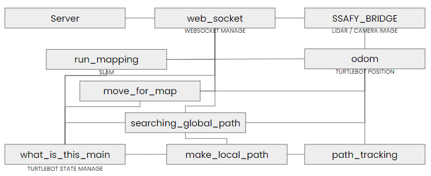

<center><h1>Outline of IoT</h1></center>

Duration : August 21, 2023 (Mon) ~ October 6, 2023 (Fri)

Theme : 신축 건축물의 사전점검/홈체크 서비스

Service Name : **_이게뭐징 (What is this)_**

Member : 신성환, 조은정

## :computer: Development Environment

Device : Turtle Bot Burger (In Simulation)

Os : Windows

Python : 3.7.5

Ros : eloquent (20200124 release)

Openssl : 1.0.2u

rti : 5.3.1

opensplice : 6.9.190403

tensorflow : 1.15

CUDA Toolkit : 10.1

cuDNN : 7.6.4

## :bookmark_tabs: Installation

- ROS 설치 후 패키지 빌드 (In x64 Native Tools Command Prompt For VS 2019)

  ```bash
  call C:\your\path\ros2_eloquent\setup.bat
  cd C:\your\package\path\path
  colcon build
  ```

- 패키지 실행

  ssafybridge 실행

  ```cmd
  call C:\dev\ros2_eloquent\setup.bat
  call C:\your\package\path\local_setup.bat
  ros2 launch C:\your\package\path\src\ssafy_bridge\launch\ssafybridge_launch.py
  ```

  What_is_this 실행

  ```cmd
  call C:\dev\ros2_eloquent\setup.bat
  call C:\your\package\path\install\local_setup.bat
  ros2 launch C:\your\package\path\src\what_is_this\launch\what_is_this_launch.py
  ```

## 📺File Path

```
embedded
├ what_is_this
│ ├ ssafy_bridge
│ ├ ssafy_msgs
│ └ what_is_this
│   ├ launch
│   │ └ what_is_this_launch.py
│   ├ map
│   │ └ map.txt
│   ├ resource
│   │ └ what_is_this
│   ├ test
│   │ ├ test_copyright.py
│   │ ├ test_flake8.py
│   │ └ test_pep257.py
│   ├ what_is_this
│   │ ├ make_local_path.py
│   │ ├ move_for_map.py
│   │ ├ odom.py
│   │ ├ path_tracking.py
│   │ ├ run_mapping.py
│   │ ├ searching_global_path.py
│   │ ├ web_socket.py
│   │ ├ what_is_this_main.py
│   │ └ utilst.py
│   ├ package.xml
│   ├ setup.cfg
│   └ setup.py
└ img <- images
```

## 🧬Architecture Diagram

- 전체

  

- ROS

  


## ⚙Tech

- 웹 소켓 연결 후, 업무 시작

  

- 벽 면을 따라다니며 Mapping

  ​	

- Mapping 도중에는 탐색중으로 Application에 표시

  

- Mapping 완료 후 경로 생성 알고리즘에 따른 Global Path 생성

  

- Global Path에 따른 경로 추종

  

- Local Path에 따른 경로 추종시 맵 데이터와 진행율을 Application으로 전송

  

- 탐색 도중 흠집정보 인식시 좌표와 이미지를 Application으로 전송

  

- 경로 생성의 경우 탐색 경로 간격을 조절할 수 있다.

  


## :foggy: Role

- 신성환
  - Turtle bot status 관리
  - access Token 관리
  - Web socket 구현
  - Thread 처리
  - 경로 생성 알고리즘 작성
  - Gird/Cell 좌표 변환 및 데이터 이미지화
- 조은정
  - SLAM 구현
  - 흠집 정보 확인 & 이미지 생성 및 흠집 좌표 생성
  - 지역 경로 생성
