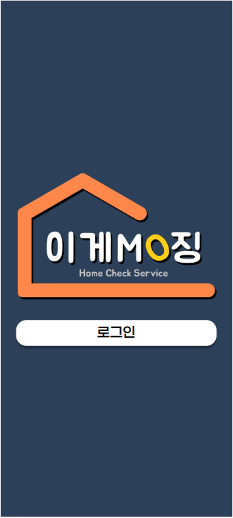
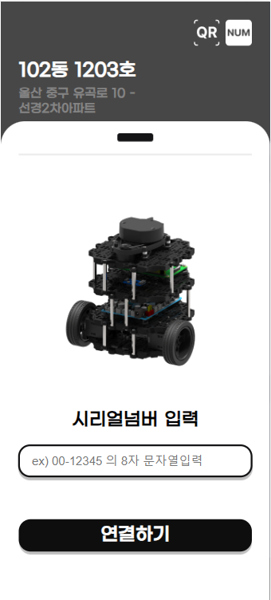
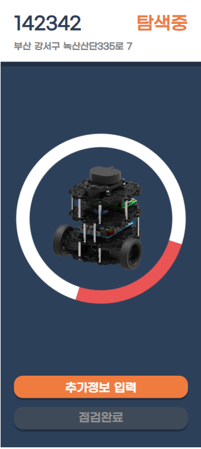
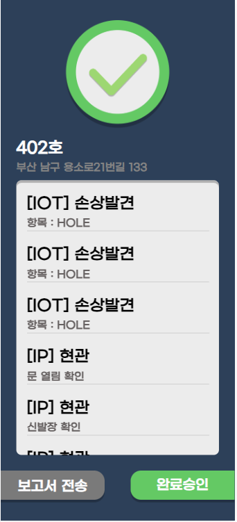

E203

# Outline of FrontEnd

Duration : August 21, 2023 (Mon) ~ October 6, 2023 (Fri)

Theme : 신축 건축물의 사전점검/홈체크 서비스

Service Name : ***이게뭐징 (What is this)***

Member : 조병철

---

## 💻 Development Environment

node : v18.16.1

react : v17.0.2 

react-qr-reader :  v3.0.0-beta-1

react-zxing : v2.0.0

react-router-dom : v6.15.0

---

## 📺File Path

+---src
 | App.css
  | App.jsx
 | index.css
 | index.js
 | service-worker.js
 | serviceWorkerRegistration.js
 |
 +---components
 | Building.jsx
 | HouseCard.jsx
 | HouseInfo.jsx
 | HouseTodoList.jsx
 | MyButton.jsx
 | MyInput.jsx
 | Notification.jsx
 | QRrecognition.jsx
 | SectionDetail.jsx
 | SerialNumberRecognition.jsx
 | TodoAddSection.jsx
 | TodoListItem.jsx
 | TodoListMain.jsx
 | TodoSectionItem.jsx
 |
 +---pages
 | Camera.jsx
 | Connection.jsx
 | ConnectionResult.jsx
 | Error.jsx
 | Home.jsx
 | HouseDetail.jsx
 | HouseList.jsx
 | HouseResult.jsx
 | Login.jsx
 | Search.jsx
 | SearchDetail.jsx
 |
 +---test
 | CircularProgressBar.jsx
 |
 ---utils
 AuthHttp.js
 ParseAddress.js
 WebSocket.js

---

## 🧬Architecture Diagram

  

---

⚙View

사용자 로그인

사용자 할당 업무 조회

터틀봇 통신 방식 QR / 시리얼번호

기기 연결 통신 확인 후 버튼 활성화 및 다음 단계 수행 가능

통신이 완료된 항목 및 상세조회

기기 현황 및 사용자 작업 목록 추가

작업 완료 후 사용자/기기 결함 및 체크리스트 확인

----

## 🌁 Role

- 조병철
  - 모바일 서비스 제공 UI/UX 제작
  - 언어친숙도를 높이고자 라이브러리 사용 최소화
  - 토큰 기반 autherized axios 통신
  - 소켓 통신을 통해 진행 상황 실시간 정보 출력
  - PWA를 통해 모바일 서비스 제공
  - 컨텍스트 활용 등 불필요한 구간에서 데이터 호출, 전달 감소
  - 컴포넌트 분할
