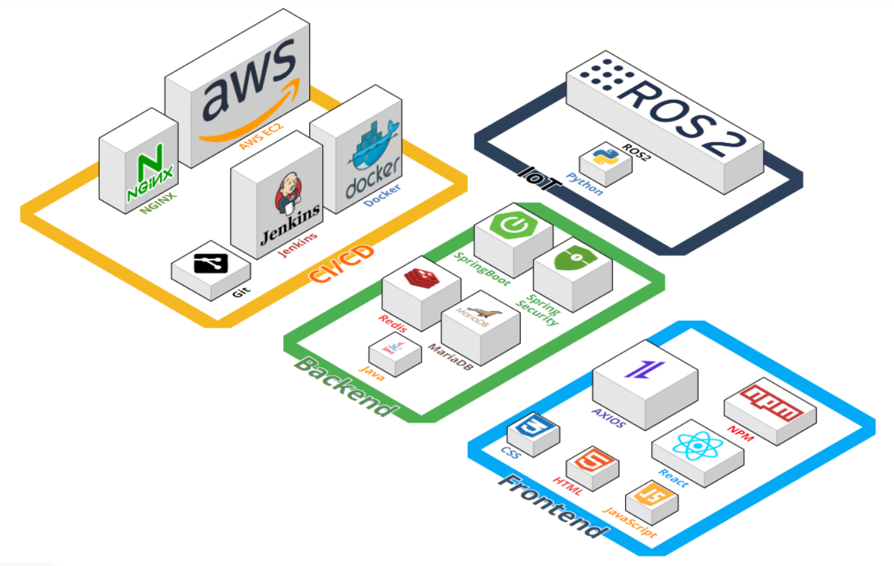
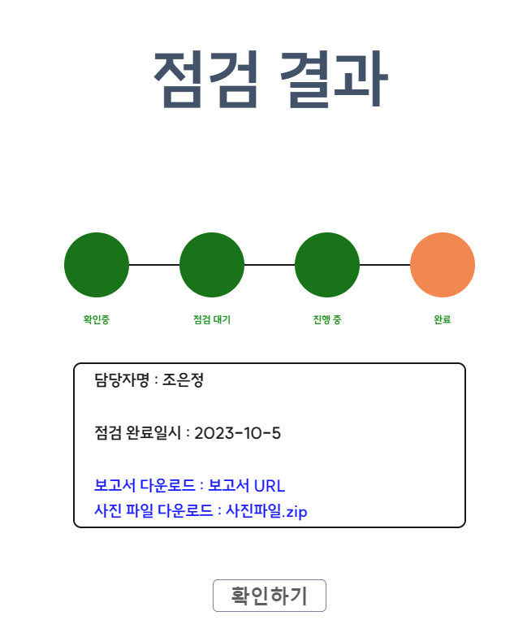
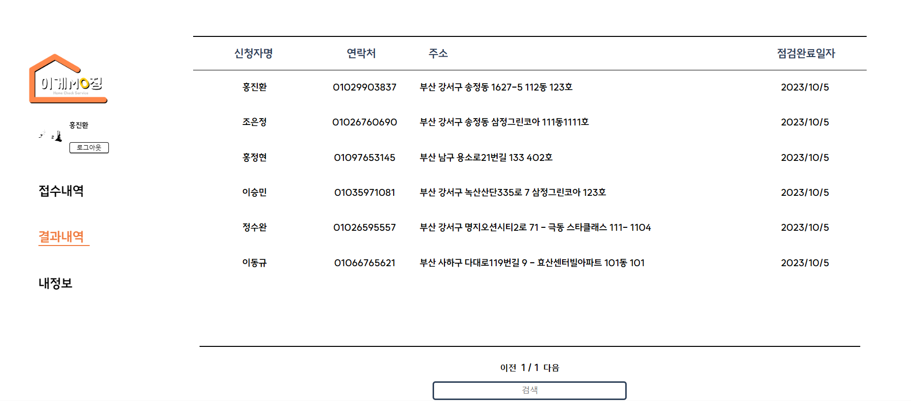
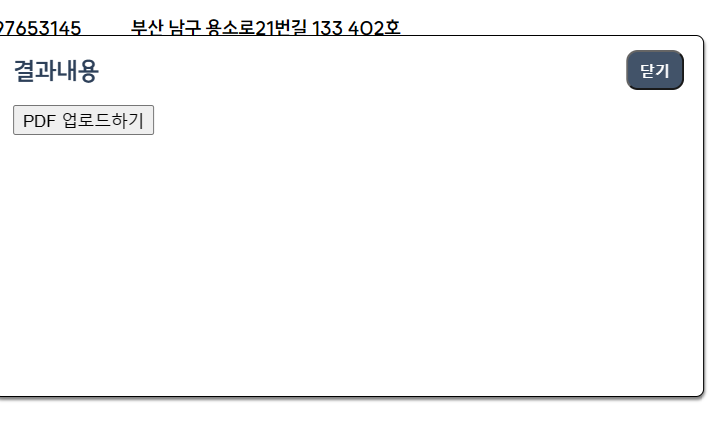
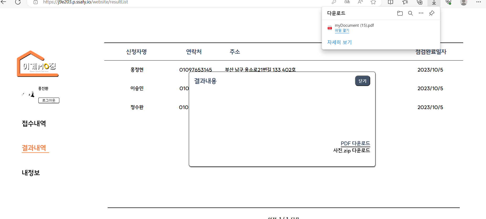
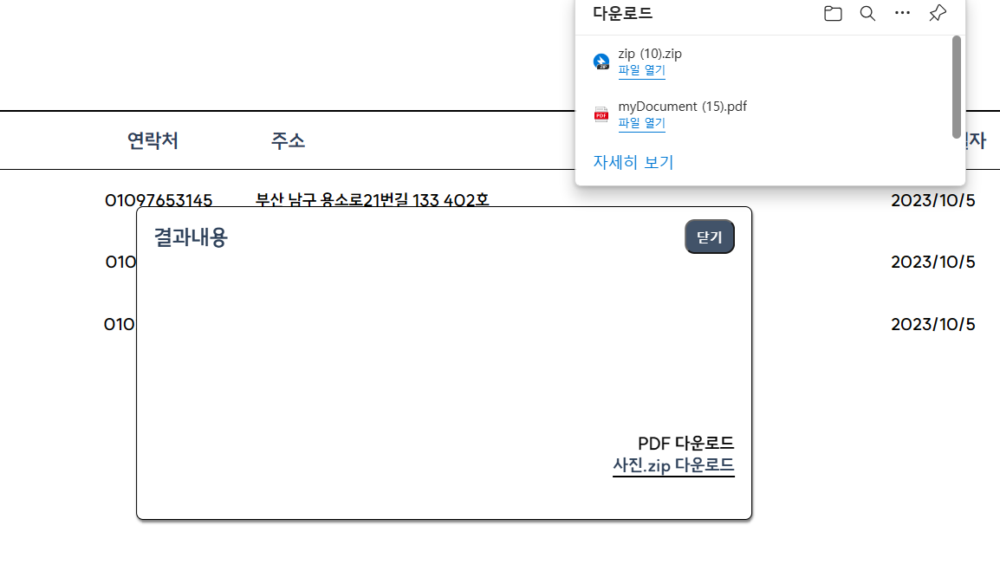
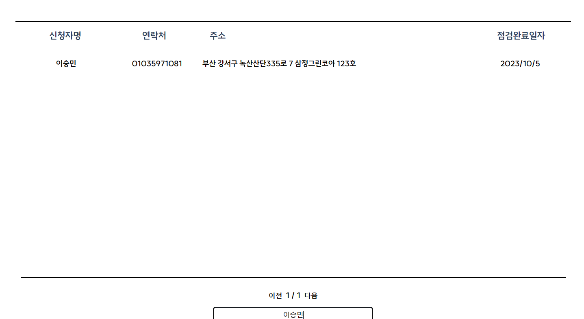

# Outline of FrontEnd

Duration : August 21, 2023 (Mon) ~ October 6, 2023 (Fri)

Theme : 신축 건축물의 사전점검/홈체크 서비스

Service Name : ***이게뭐징 (What is this)***

Member : 홍진환

---

## 💻 Development Environment

Os: Windows

React: 18.2.0
    **Website**

    axios: 1.5.0

    js-cookie: 3.0.5

    react-beautiful-dnd: 13.1.1

    react-datepicker: 4.17.0

    react-dom: 18.2.0

    react-icons: 4.11.0

    react-router-dom: 6.16.0

    react-scripts: 5.0.1

    react-to-pdf: 1.0.1

    react-to-print: 2.14.15

   @react-pdf/renderer: 3.1.12

    **Customersite**

   react-icons: 4.11.0

   react-responsive: 9.0.2

   react-router-dom: 6.16.0

   react-scripts: 5.0.1

   react-to-pdf: 1.0.1

   react-to-print: 2.14.15

   styled-components: 6.0.8

---

## 📑 Installation

라이브러리 설치

```
npm install js-cookie
npm install react-beautiful-dnd
npm install react-datepicker
npm intall react-to-pdf
npm install @react-pdf/renderer --save
npm install react-responsive
```

---

## 🧬Architecture Diagram

- 전체
  
  

---

## ⚙Flow

### customersite

고객의 점검 신청 => 휴대폰 인증을 통한 권한 설정

휴대폰 인증을 통한 권한 확인 후 status에 따라 결제대기(가상계좌를 통한 결제), 점검 대기, 점검 중, 점검완료 페이지로 이동

ex) 점검결과 페이지

### Website

접수내역(칸반보드)을 통한 대기 수락 => 날짜 기입을 통한 점검 날짜 설정



결과확인을 통한 pdf와 사진자료 업로드 및 다운로드

Pdf 업로드 후
다운로드 기능 생성

 Pdf 다운로드 시 장면
 사진 다운로드 시 장면

 다운로드시 폴더 장면 검색기능

----

## 🌁 Role

- 홍진환
  FrontEnd
  - 직원페이지 제작
  - 고객페이지 제작
  - Pdf 업로드, 다운로드
  - dnd, pdf 등 라이브러리 적용
  - 로그인 로그아웃 최초가입 생성